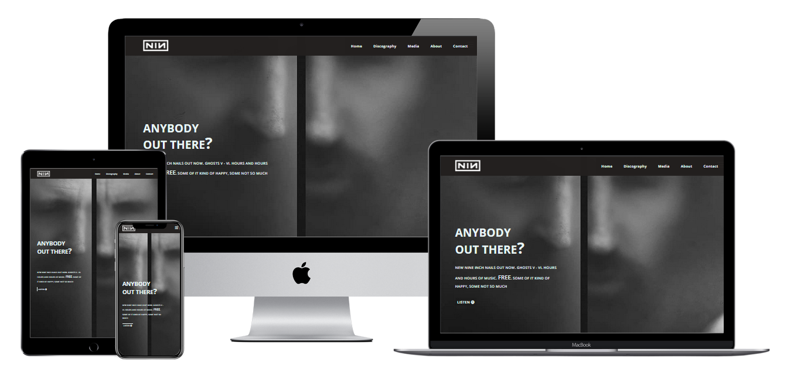
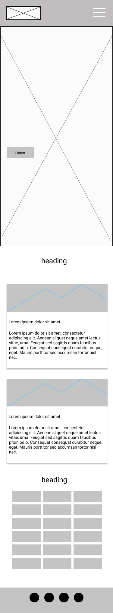
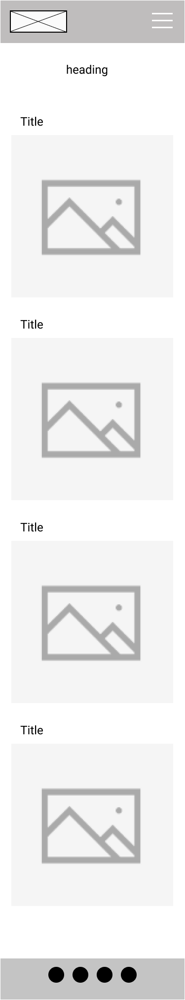
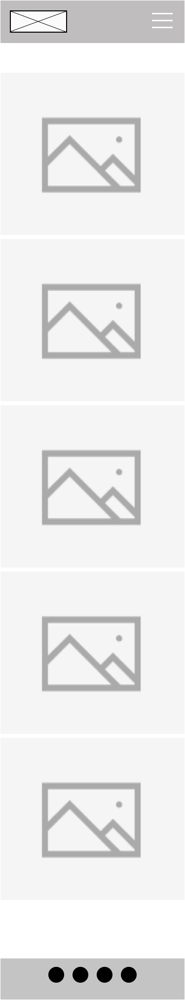
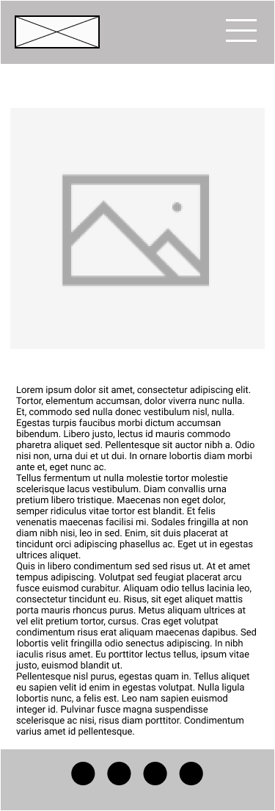
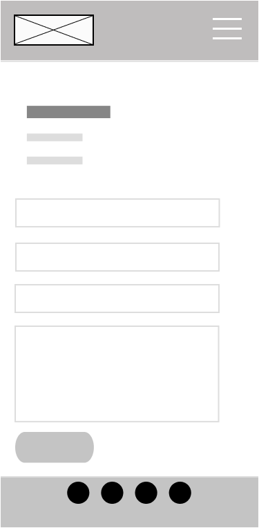

# NIN Website Redesign

This is a redesign of the Nine Inch Nails website, with the aim to bring a new look to the site, and to showcase the band music, and provide hub for news and information about the band.

With that in mind, I have included News, and tour dates on the main page. From there are links to discography, media, about and contact pages.

## UX

### Mockups

### User Stories

The site is primarily for existing fans of the band, but will also provide new fans a place to learn more about the band.
Fans will be able to access Music, images and social media directly form the website.

* As a fan, I want to listen to the bands latest music
* As a fan, I want to read news about the band
* As a fan, I want to be able to find tour dates
* As a fan, I want to find images of the band, and their concerts
* As a new fan I want to be able to browse the band discography and find out more about the band
* As a promoter I want to be able to contact the band to book a show

### Wireframes

## Features

1. Hero section on index.html -  Notice that new album is out, with a button linking to spotify
2. Slide in navigation menu on mobile. This provides links to other pages and social media.
3. Discography page -  displays the cover images of the band albums, and links to spotify page for each.
4. Gallery page with images of the band. Using fancybox to allow the user to click on the image to enlarge.
5. About page -  Information about the band
6. Contact page -  users can fill out contact form to contact band direclty.

## Technologies Used

* [HTML5](https://www.w3schools.com/html/)
* [CSS](https://www.w3.org/Style/CSS/Overview.en.html)
* [VSCode Insiders](https://code.visualstudio.com/) -  IDE used for all code editing
* [GitHub](https://github.com) -  Version control and hosting
* [fancybox](https://fancyapps.com/fancybox/) -  Image Gallery
* [Squoosh](https://squoosh.app/) -  Resizing, and compressing images
* [Font Awesome](https://fontawesome.com/) -  Social Icons
* [Google Fonts](https://fonts.google.com/) -  Open Sans font

## Testing

## Deployment

I deployed the site using GitHub Pages.

Steps taken -

1. Navigate to Repo, and select settings
2. Scroll to GitHub Pages section.
3. Click on source dropdown and choose appropriate branch.
4. A link to the newly deployed site is then displayed at the top of the section.

To Deploy my project localy -

1. Again navigate to the repo.
2. In the top right of the page there is a green "clone or download button".
3. On pressing this a number of options are given -  Download a zip file, open using github desktop application, or clone using GIT cli with `git clone https://github.com/ehackett/milestone-1.git`

## Credits

### Content

* Music is linked from Spotify
* Text for about section is taken from wikipedia [Wikipedia](https://en.wikipedia.org/wiki/Nine_Inch_Nails)

### Media
* Images taken from Nine Inch Nails website [nin.com](https://www.nin.com), and NIN Flikr page [flikr](https://www.flickr.com/photos/nineinchnails/)

### Acknowledgements

* Brad Traversy -  [Modern HTML and CSS from the beginning](https://www.udemy.com/course/modern-html-css-from-the-beginning/)
